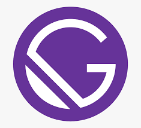

<div align="center">
  <a href="https://github.com/othneildrew/Best-README-Template">
    
  </a>

  <h3 align="center">Dimas Prasetyo </h3>

  <p align="center">
    Welcome to prasetyodev a professional site portofolio & blog
  </p>
</div>


<!-- TABLE OF CONTENTS -->
<details>
  <summary>Table of Contents</summary>
  <ol>
    <li>
      <a href="#about-the-project">About The Project</a>
      <ul>
        <li><a href="#built-with">Built With</a></li>
      </ul>
    </li>
    <li>
      <a href="#getting-started">Getting Started</a>
      <ul>
        <li><a href="#prerequisites">Prerequisites</a></li>
        <li><a href="#installation">Installation</a></li>
      </ul>
    </li>
    <li><a href="#usage">Usage</a></li>
    <li><a href="#contact">Contact</a></li>
  </ol>
</details>

<!-- ABOUT THE PROJECT -->
## About The Project

The purpose of this application is to create a professional portfolio and blog.

### Built With

This section should list any major frameworks/libraries used to bootstrap your project. Leave any add-ons/plugins for the acknowledgements section. Here are a few examples.

* Gatsby React Framework.
* CSS Prepocessor ( SCSS ).
* Markdown.

<!-- GETTING STARTED -->
## Getting Started

This is an example of how you may give instructions on setting up your project locally.
To get a local copy up and running follow these simple example steps.

### Prerequisites

This is an example of how to list things you need to use the software and how to install them.
* npm
  ```sh
  npm install npm@latest -g
  ```

### Installation

_Below is an example of how you can instruct your audience on installing and setting up your app. This template doesn't rely on any external dependencies or services._

1. Clone the repo
   ```sh
   git clone https://github.com/your_username_/Project-Name.git
   ```
3. Install NPM packages
   ```sh
   npm install
   ```
4. How to running`
   ```
   npm run start / gatsby develop
   ```

<!-- USAGE EXAMPLES -->
## Usage

If you want to use the project template that I use, I will share it for free. I have tweaked or customized the settings according to your needs. I use Gatsby framework technology. If you are interested in learning, you can directly check the official documentation.

_For more examples, please refer to the [Documentation](https://www.gatsbyjs.com/)_

## Contact

Linkedin : [@Dimas Prasetyo](https://www.linkedin.com/in/dimas-prasetyo)

Email : dimasprasetyo485@gmail.com
