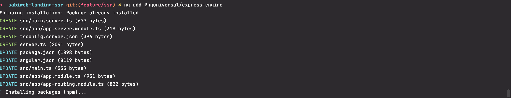
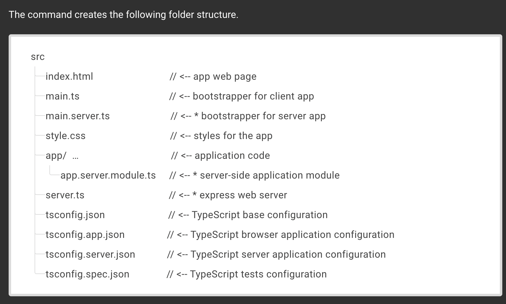
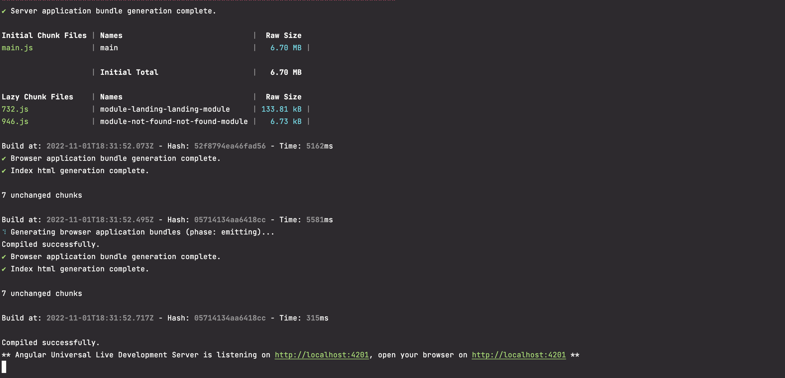

Pengertian dari teknik SSR, Server Side Rendering atau SSR merupakan salah satu jenis metode rendering, dimana proses kompilasi / rendering dilakukan pada sisi server.

Berbeda dengan SSR, CSR melakukan rendering saat client atau web browser menerima data dari server, hal ini biasanya dilakukan oleh Javascript saat menampilkan data ke halaman web.

##### Server Side Rendering :

<details>

<summary>Kelebihan </summary>

Memiliki kelebihan pada optimasi index mesin pencari, mesin pencari lebih mudah menemukan keyword pada konten yang telah dirender.

</details>

<details>

<summary>Kekurangan</summary>

Mengandalkan perfomance/resource server dalam melakukan rendering, sehingga membutuhkan resource yang terus meningkat seiring peningkatan jumlah visitor.

</details>

##### Client Side Rendering :

<details>

<summary>Kelebihan </summary>

Menggunakan mode **CSR** akan mengurangi beban server, hal ini dikarenakan proses rendering dilakukan oleh web browser.

</details>

<details>

<summary>Kekurangan</summary>

Fungsional / perfomance website sangat bergantung pada kemampuan web browser.

</details>

### Mengapa menggunakan rendering disisi server?

Ada 3 alasan kenapa kita melakukan hal ini dengan bantuan dari angular **Universal version** pada aplikasi kita.

- Memfasilitasi web crawlers terkait optimasi SEO [search engine optimization (SEO)](https://static.googleusercontent.com/media/www.google.com/en//webmasters/docs/search-engine-optimization-starter-guide.pdf).
- improvisasi dari segi performa di mobile / device yang memiliki device rendah.
- Menampilkan halaman dengan cepat dengan metrik **Page Speed Insight** salah satunya adalah [\*\*first-contentful paint (FCP)](https://developers.google.com/web/tools/lighthouse/audits/first-contentful-paint).\*\*

### Penerapan Metode SSR pada Sahabat Bisnis Inovasi ( SABI ).

1. Pada repo landing dengan metode CSR kita install package dari angular universal https://angular.io/guide/universal

#### Enable server-side rendering

Untuk membuat aplikasi baru dengan SSR, jalankan :

```code
  ng new --ssr
```

Untuk menambahkan SSR ke proyek yang sudah ada, gunakan perintah Angular CLI ng add.

```code
  ng add @angular/ssr
```

Perintah ini membuat dan memperbarui kode aplikasi untuk mengaktifkan SSR dan menambahkan file tambahan ke struktur proyek.

```code
 my-app
 |-- server.ts                       # application server
 └── src
     |-- app
     |   └── app.config.server.ts    # server application configuration
     └── main.server.ts              # main server application bootstrapping
```

2. Check SSR sudah berhasil terimplementasi di sabiweb-landing, Universal in action type in your terminal ng add @nguniversal/express-engine.

Hasil Angular universal express engine.







3. Cara menjalankan aplikasi **sabiweb-landing-ssr** contoh \*\*\*\*perintah dasar tanpa environment yang berbeda ditiap server.

   ```json
   "dev:ssr": "ng run sabi-landing:serve-ssr",
   "serve:ssr": "node dist/sabi-landing/server/main.js",
   "build:ssr": "ng build && ng run sabi-landing:server",
   "prerender": "ng run sabi-landing:prerender"
   ```

   ```markdown
   Pengertian :
   "dev:ssr" -> perintah menjalankan development SSR mode di local env.
   "serve:ssr" -> perintah menjalankan mode SSR hasil dari build:ssr
   "build:ssr" -> perintah menjalankan mode bundle / build dengan SSR build:ssr:{env}
   "prerender" -> perintah untuk prarendering adalah proses di mana halaman dinamis diproses pada waktu pembuatan menghasilkan HTML statis.
   ```

**Pertimbangan Penting saat Menggunakan Angular Universal**

> Meskipun tujuan dari proyek Universal adalah kemampuan untuk merender aplikasi Angular dengan mulus di server, ada beberapa inkonsistensi yang harus di pertimbangkan.

1. Pertama, ada perbedaan yang jelas antara lingkungan server dan browser. Saat merender di server, aplikasi Anda dalam status singkat atau "snapshot". Aplikasi sepenuhnya dirender sekali, dengan HTML yang dihasilkan dikembalikan, dan status aplikasi yang tersisa dimusnahkan hingga render berikutnya.
2. Lingkungan server secara **_inheren_** ( **berhubungan erat )** tidak memiliki kemampuan yang sama dengan browser (memiliki beberapa yang juga tidak dimiliki browser). Misalnya, server tidak memiliki konsep **cookie**. Anda dapat melakukan polyfill ini dan fungsionalitas lainnya, tetapi tidak ada solusi sempurna untuk ini.
3. Di bagian selanjutnya, kita akan membahas potensi mitigasi **( upaya untuk mengurangi resiko ),** untuk mengurangi cakupan kesalahan saat merender di server.

**Harap perhatikan juga tujuan SSR** : meningkatkan waktu rendering awal untuk aplikasi.

Ini berarti bahwa segala sesuatu yang berpotensi mengurangi kecepatan aplikasi dalam rendering awal ini harus dihindari atau dicegah. Sekali lagi, kita akan meninjau cara melakukannya di bagian selanjutnya.

**Masalah yang dihadapi ketika enable SSR mode :**

1. “\***\*window”\*\*** contoh jika kita menggunakan window.location.href =’target_link’
2. “**\*\***document**\*\***” contoh jika kita ingin memanipulasi DOM element misal document.getElementById(’your_class_name’).
3. “**navigator**” contoh jika kita ingin enable service worker **_( webworker )_** untuk kerpeluan **PWA.**
4. “************\*\*\*\*************strategy guard************\*\*\*\*************”
5. Initial Rendering menjadi lambat saat ini masih di cari solusinya.

**Solusi** untuk mengatasi error tersebut :

- Check setiap fungsi fungsi native js seperti **_window_**, **_document_**, **_navigator_**, **cookies** ketika ingin di inisialisasi jika ada kebutuhan di proses development ada beberapa tahapan.
  **contoh** lengkap disini **:** https://github.com/angular/universal/blob/main/docs/gotchas.md

API router strategy : initialNavigation https://angular.io/api/router/InitialNavigation

**Catatan Kaki** :

- https://kruschecompany.com/ssr-or-csr-for-progressive-web-app/

- https://cybernauts.web.id/2021/09/23/apa-itu-server-side-rendering-dan-client-side-rendering/

- https://angular.io/guide/universal

- https://github.com/angular/universal/blob/main/docs/gotchas.md

- https://www.youtube.com/watch?v=juvYWRrLtAg

- https://www.newline.co/@eigenjoy/angular-ssr-the-browser-is-not-the-server--2b398f60

- https://blog.brecht.io/prerendering-angular-apps/

- https://dev.to/maj07/pre-rendering-an-angular-app-4ado

- https://medium.com/geekculture/angular-server-side-rendering-ssr-vs-pre-rendering-and-why-do-it-in-the-first-place-28419e3220db

- https://medium.com/upstate-interactive/how-to-build-an-angular-app-with-server-side-rendering-f7f415b851c8

- https://medium.com/jspoint/server-side-rendering-ssr-in-angular-5-the-simplest-and-quickest-ssr-approach-34cf53224f32

- https://catalincodes.com/posts/efficient-content-hydration-with-angular-universal
